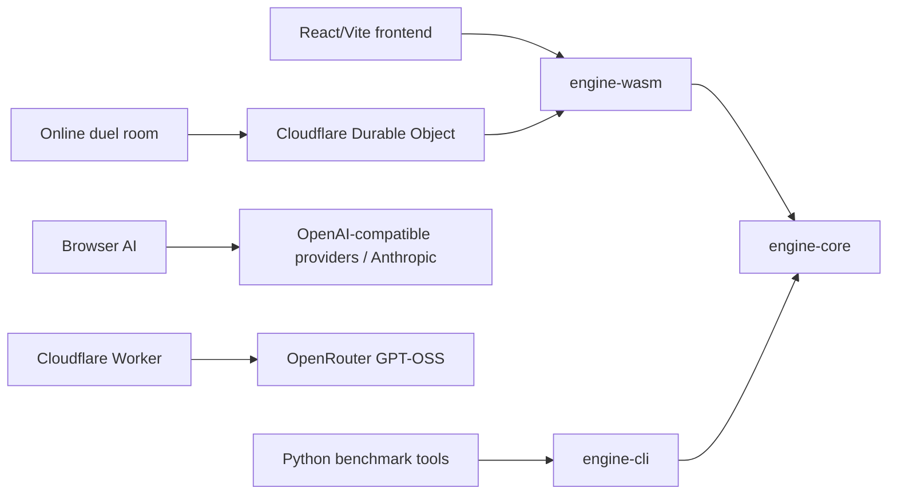

# Phalanx Arena


<br />

Phalanx Arena is a deterministic ancient-battle tactics game and LLM benchmark. It supports local browser play, Cloudflare room-code online duels, browser AI turns through Hosted GPT-OSS or player-supplied API keys, and offline AI-vs-AI benchmark runs.

For an analysis of the project and benchmark results, see [this article](https://vestigia.org/phalanxarena/intro).

It is inspired by ancients rulesets such as De Bellis Antiquitatis (DBA), but it is original and not a literal implementation of any existing game. The engine is deterministic, inspectable, and designed for replayable benchmark runs.


## Quick Start

### Browser Game

From the repo root:

```powershell
cd .\frontend
npm install
npm run dev
```

The Vite app uses the local WASM engine. `npm run dev` tries to rebuild `engine-wasm`; if `wasm-pack` is missing and the committed WASM bundle is complete, it reuses the committed bundle.

Use the `AI Controls` dropdown in the app to assign AI to army `A`, army `B`, or both. In `AI Setup`, choose Hosted GPT-OSS or Bring your own key. BYO-key mode supports `openai`, `anthropic`, `xai`, `mistral`, `gemini`, `together`, and `openrouter`.

On the Cloudflare deployment, `Online Duel` creates or joins a room code backed by a Durable Object WebSocket room. Local Vite dev does not host Durable Objects; use `npx wrangler dev` from `frontend/` when testing online rooms locally.

For frontend details, replay video generation, and Cloudflare deployment, see [frontend/README.md](frontend/README.md).

### Headless Benchmark

From `backend/`:

```powershell
uv sync --group dev
uv run phalanx-headless-benchmark `
  --scenario classic_battle `
  --games 10 `
  --seed-start 7 `
  --model-a openai/gpt-5.5 `
  --provider-a openrouter `
  --model-b anthropic/claude-opus-4.7 `
  --provider-b openrouter `
  --output headless-benchmark.json
```

Tournament runs use `phalanx-headless-tournament`. The canonical roster lives at [backend/tournament-roster.json](backend/tournament-roster.json); detailed tournament, scoring, resume, and report behavior lives in [backend/README.md](backend/README.md).

## Requirements

- Rust toolchain
- Node.js and npm
- Python 3.11+
- `uv`
- `wasm-pack` when rebuilding `engine-wasm`

## Architecture



## Repository Layout

- `frontend/` - React/Vite browser app, 3D battlefield, replay UI, browser AI, Cloudflare Worker.
- `backend/` - Python benchmark and tournament CLIs, provider orchestration, reports.
- `engine/engine-core/` - deterministic Rust rules engine, scenario catalog, prompting helpers.
- `engine/engine-wasm/` - browser binding for `engine-core`.
- `engine/engine-cli/` - persistent JSON stdio bridge for Python tooling.
- `3Dassets/` - models and textures used by the frontend; see [3Dassets/README.md](3Dassets/README.md) for asset notes.
- `shared/` - shared AI provider catalog and prompt text.

## Simulation Scope

The current engine is a square-grid deterministic ancients simulator with deployment, one built-in scenario (`classic_battle`), terrain-aware movement and combat, legal action generation, replay import/export, undo, missile fire, bound-end close combat, attrition victory, battle scoring, and LLM-oriented prompt generation.

The rules summary used for AI prompting lives in [game_rules.md](game_rules.md).

## Verification

```powershell
cd .\frontend
npm run build
```

```powershell
cd .\backend
uv run pytest
```

```powershell
cargo build -p engine-cli
```

## License

Phalanx Arena is distributed under the MIT license. See [LICENSE](LICENSE).
